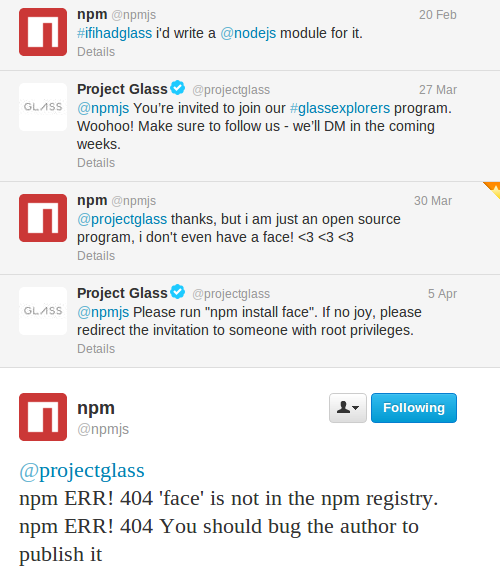

Face
====

Side loadable app to bi-directionally communicate from Google Glass to a websocket


## How it works

When the app is loaded onto a Google Glass device, it creates a WebSocket server on the device and displays the IP to connect to.  The server is started on port 1338 by default.

The heads up display shows any incoming messages, the gyrosocpe values (azimuth, pitch, roll), any error messages, and the IP address.
The IP address can be used by other web applications to connect to the same websocket server on port 1338 for private notifications.

There are also two buttons that can be clicked from the Glass' track pad.  They will broadcast an event with an 'A' or 'B' value respectively to each client connected on the same channel.

## Usage

The Glass broadcasts sensor data messages to all connected clients under the 'broadcast' topic.  The data is formatted as:
```javascript
{
  "buttons": {
    "A": false,
    "B": false
  },
  "orientation":{
    "pitch":-95.88117980957031,
    "roll":-1.8725770711898804,
    "azimuth":283.96575927734375
  },
  "gestures": {
    "tap": false,
    "scrollLeft": false,
    "scrollRight": false,
    "down": false,
    "longPress": false,
    "doubleTap": false
  }
}
```

## Why?

[](https://twitter.com/npmjs/status/320570485127667713)

## License

The MIT License (MIT)

Copyright (c) 2013 Iced Development, LLC

Permission is hereby granted, free of charge, to any person obtaining a copy of this software and associated documentation files (the "Software"), to deal in the Software without restriction, including without limitation the rights to use, copy, modify, merge, publish, distribute, sublicense, and/or sell copies of the Software, and to permit persons to whom the Software is furnished to do so, subject to the following conditions:

The above copyright notice and this permission notice shall be included in all copies or substantial portions of the Software.

THE SOFTWARE IS PROVIDED "AS IS", WITHOUT WARRANTY OF ANY KIND, EXPRESS OR IMPLIED, INCLUDING BUT NOT LIMITED TO THE WARRANTIES OF MERCHANTABILITY, FITNESS FOR A PARTICULAR PURPOSE AND NONINFRINGEMENT. IN NO EVENT SHALL THE AUTHORS OR COPYRIGHT HOLDERS BE LIABLE FOR ANY CLAIM, DAMAGES OR OTHER LIABILITY, WHETHER IN AN ACTION OF CONTRACT, TORT OR OTHERWISE, ARISING FROM, OUT OF OR IN CONNECTION WITH THE SOFTWARE OR THE USE OR OTHER DEALINGS IN THE SOFTWARE.
